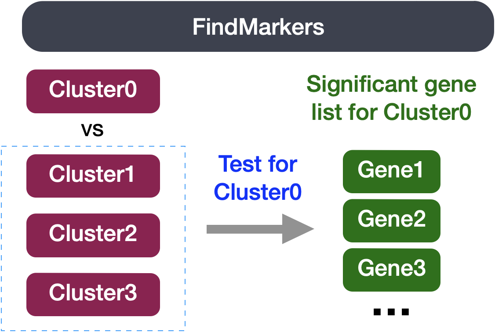

Approximate time: 75 minutes

```{r}
#| label: load_data
#| echo: false
seurat <- readRDS("data/BAT_GSE160585_final.rds")
```

## Learning Objectives:

* Evaluate differential gene expression between conditions using a Wilcoxon rank sum test

## Differential expression between conditions using FindMarkers()

In our current UMAP, we have merged samples across the different conditions and used integration to align cells of the same celltype across samples. Now, what if we were interested in a particular celltype and **understanding how gene expression changes across the different conditions?**

The `FindMarkers()` function in the Seurat package is used to perform differential expression analysis between groups of cells. We provide arguments to specify `ident.1` and `ident.2` the two groups of cells we are interested in comparing. This function is commonly used at the [celltype annotation step](https://hbctraining.github.io/Intro-to-scRNAseq/lessons/09_merged_SC_marker_identification.html), but can also be used to calculate differentially expressed genes between experimental conditions.

<p align="center">
    
</p>


We can use this same function to compare two groups of cells which represent different conditions by modifying the `ident` values provided. The `FindMarkers()` function has **several important arguments** we can modify when running it. To view what these parameters are, we can access the help page on this function:

```{r}
#| label: FindMarkers_help
#| eval: false
?FindMarkers
```

Below we have described in more detail what each of these arguments mean :

- `logfc.threshold`: The minimum log2 fold change for average expression of gene in group relative to the average expression in all other groups combined. Default is 0.25.
- `min.diff.pct`: The minimum percent difference between the percent of cells expressing the gene in the group and the percent of cells expressing gene in all other groups combined.
- `min.pct`: Only test genes that are detected in a minimum fraction of cells in either of the two populations. Meant to speed up the function by not testing genes that are very infrequently expressed. Default is 0.1.
- `ident.1`: This function only evaluates one group at a time; here you would specify the group of interest. These values must be set in the `Idents()`.
- `ident.2`: Here you would specify the group you want to compare `ident.1` against.


## Setting up 
Open up a new Rscript file, and start with some comments to indicate what this file is going to contain:

```{r}
#| label: script_header
# Single-cell RNA-seq DE analysis - FindMarkers
```
Save the Rscript as findMarkers.R. 

### Load libraries
Now let's load the required libraries for this analysis:

```{r}
#| label: load_libraries
# Load libraries
library(Seurat)
library(tidyverse)
library(EnhancedVolcano)
```

## FindMarkers()

To use the function to look for DE genes between conditions, there are two things we need to do:

1. Subset the Seurat object to our celltype of interest
2. Set our active Idents to be the metadata column which specifies what condition each cell is
   
In our example we are focusing on vascular smooth muscle (`VSM`) cells. The comparison we will be making is `TN` vs. `cold7`.

```{r}
#| label: subset_object_vsm
# Subset the object
seurat_vsm <- subset(seurat, subset = (celltype == "VSM"))

# Set the idents
Idents(seurat_vsm) <- "condition"
seurat_vsm
```

Before we make our comparisons we will explicitly set our default assay, we want to use the **normalized data, not the integrated data**.

```{r}
#| label: set_default_assay
# Set default assay
DefaultAssay(seurat_vsm) <- "RNA"
```

The default assay should have already been `RNA`, but we encourage you to run this line of code above to be absolutely sure in case the active slot was changed somewhere upstream in your analysis. 

::: callout-note
# Why don't we use SCT normalized data?
Note that the raw and normalized counts are stored in the `counts` and `data` slots of `RNA` assay, respectively. By default, the functions for finding markers will use normalized data if RNA is the DefaultAssay. The number of features in the `RNA` assay corresponds to all genes in our dataset.

Now if we consider the `SCT` assay, functions for finding markers would use the `scale.data` slot which is the pearson residuals that come out of regularized NB regression. Differential expression on these values can be difficult interpret. Additionally, only the variable features are represented in this assay and so we may not have data for some of our marker genes.
:::

Now we can run `FindMarkers()`:

```{r}
#| label: run_FindMarkers
# Determine differentiating markers for TN and cold7
dge_vsm <- FindMarkers(seurat_vsm,
                       ident.1="cold7",
                       ident.2="TN")

# Store the rownames (genes) as a column
dge_vsm$gene <- rownames(dge_vsm)
```

Now let's take a quick look at the results:

```{r}
#| label: view_FindMarkers
#| eval: false
# View results 
View(dge_vsm)
```

```{r}
#| label: DT_FindMarkers
#| echo: false
library(DT)
datatable(dge_vsm %>% head(30))
```

**The output from the `FindMarkers()` function** is a matrix containing a ranked list of differentially expressed genes listed by gene ID and associated statistics. We describe some of these columns below:

- **gene:** The gene symbol
- **p_val:** The p-value not adjusted for multiple test corrections
- **avg_logFC:** The average log-fold change between sample groups. Positive values indicate that the gene is more highly expressed `ident.1`.	
- **pct.1:** The percentage of cells where the gene is detected in `ident.1` (cold7)	
- **pct.2:** The percentage of cells where the gene is detected on average in `ident.2` (TN)
- **p_val_adj:** The adjusted p-value, based on Bonferroni correction using all genes in the dataset, used to determine significance

::: callout-note
These tests treat each cell as an independent replicate and ignore inherent correlations between cells originating from the same sample. This results in highly **inflated p-values** for each gene. Studies have been shown to find a large number of false positive associations with these results.
:::

When looking at the output, **we suggest looking for markers with large differences in expression between `pct.1` and `pct.2` and larger fold changes**. For instance if `pct.1` = 0.90 and `pct.2` = 0.80, it may not be as exciting of a marker. However, if `pct.2` = 0.1 instead, the bigger difference would be more convincing. Also of interest is whether the majority of cells expressing the gene are in the group of interest. If `pct.1` is low, such as 0.3, it may not be as interesting. Both of these are also possible parameters to include when running the function, as described above.

This is a great spot to pause and save your results!

```{r}
#| label: write_output
write.csv(dge_vsm, "results/findmarkers_vsm_cold7_vs_TN.csv")
```
